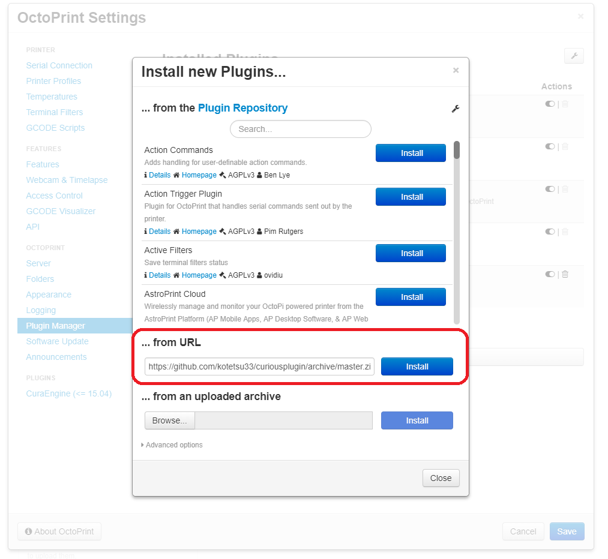

#curiousplugin

Curious Plugin provides intelligence to your printer by applying machine learning to the audio of your 3d prints.

The plugin records audio from a webcam attached to your rPi /computer running octoprint. 

## Setup

1. Please open the OctoPrint Settings.
1. Please click on [Plugin Manager] from the menu	
1. Click the [Get More] botton in Installed Plugin view.
1. Please enter in the [from URL] column
    https://github.com/kotetsu33/curiousplugin/archive/master.zip
1. Please click on [install] botton.
1. Reboot the OctoPrint.

## Configuration

There are no settings. To stop using this, either disable or remove it.

## How does it work?

It works with our own cloud with ensuring that your data is safe, secure and 100% private.
